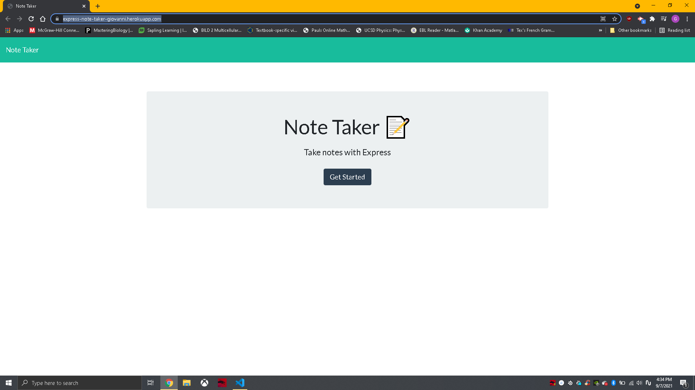

# NoteTakerExpress


## Description
Application that writes and takes notes utilizing Express package and deploying it in Heroku.

## Table of contents

* [Description](#description)
* [Installation](#installation)
* [Usage Information](#usage)
* [License](#license) 
* [Contribution](#contribution)
* [Deployed Heroku](#Heroku)
* [Contact Info](#questions)

## Installation
Run the following command for proper installation of dependencies:
```
    npm install
```

## Usage Information
The first step is to open the indicated file (index.js) in an integrated terminal. 
Using Node.js, we use the following command:
```
node server.js 
```

## License
This Project is licensed under [MIT](https://opensource.org/licenses/MIT)

## Contribution Guidelines
Thanks to:
* [https://stackoverflow.com/questions/11451535/gitignore-is-ignored-by-git](https://stackoverflow.com/questions/11451535/gitignore-is-ignored-by-git)
* [https://www.npmjs.com/package/uuid](https://www.npmjs.com/package/uuida)
* [https://nodejs.dev/learn/the-nodejs-fs-module](https://nodejs.dev/learn/the-nodejs-fs-module)
* [https://expressjs.com/en/guide/routing.html](https://expressjs.com/en/guide/routing.html)
* [https://www.freecodecamp.org/news/how-to-deploy-an-application-to-heroku/](https://www.freecodecamp.org/news/how-to-deploy-an-application-to-heroku/)

## Deployed Heroku Site and GitHub Repo:
* [https://express-note-taker-giovanni.herokuapp.com/](https://express-note-taker-giovanni.herokuapp.com/)
* [https://github.com/gisosa531/NoteTakerExpress](https://github.com/gisosa531/NoteTakerExpress)

## Images

<img src="./images/HerokuNotesSection.png" alt="The Second page where you take your notes"

## Contact Information
If you have any problems concerning the repo, please file an issue or email me at 
gio53196@gmail.com
The link to my work repositories is 
[Github Profile](https://github.com/gisosa531/).